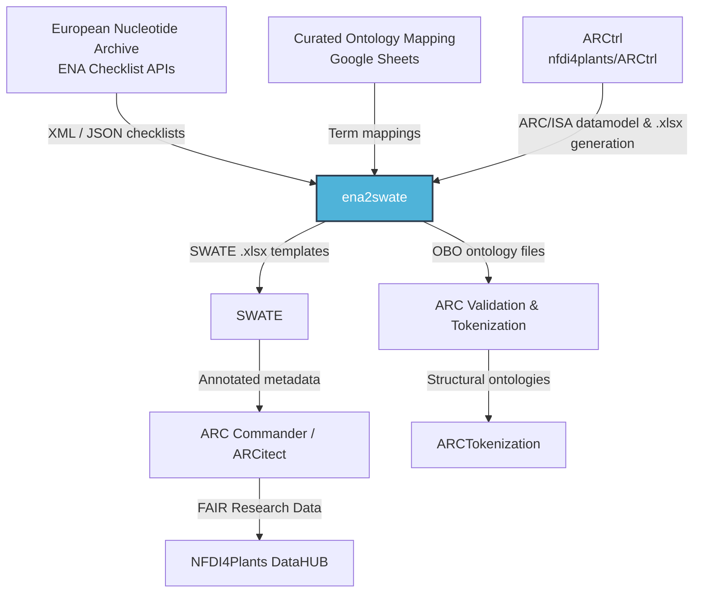

# ENA Checklists to SWATE Template

A web-based tool that generates [SWATE](https://swate-alpha.nfdi4plants.org/) templates from [ENA](https://www.ebi.ac.uk/ena) checklists for samples, raw reads, and data analyses. It bridges the European Nucleotide Archive metadata requirements with the [DataPLANT](https://nfdi4plants.org/) Annotated Research Context (ARC) ecosystem.

## Description

The ENA Checklists to SWATE Template project is a client-side web application that allows users to generate SWATE templates based on the checklists provided by the European Nucleotide Archive (ENA). The tool fetches ENA checklists for samples, raw reads, and data analyses directly from the ENA server and provides an intuitive interface for searching, selecting, and customizing checklists. Users can choose which fields to include (mandatory, recommended, or optional) and download the generated templates as `.xlsx` files ready for use in SWATE and ARC metadata annotation.

Template generation uses [ARCtrl](https://github.com/nfdi4plants/ARCtrl/), the core DataPLANT library for management of Annotated Research Contexts (ARCs).

## Features

- Fetches ENA checklists for samples, raw reads, and data analyses in real time
- Searchable dropdown interface for quickly finding the desired checklist
- Generates SWATE templates based on the selected checklist and user preferences (mandatory, recommended, optional fields)
- Maps ENA terms to ontology terms using a curated mapping table
- Provides options to download the generated SWATE templates as Excel files
- Exports checklist metadata as OBO ontology files

## Usage

### 1. Open the web application
Open [`index.html`](index.html) in a modern web browser, or visit the deployed GitHub Pages site.


### 2. Select a checklist
Choose the desired checklist category (samples, raw reads, or data analyses) from the dropdown, or type to search for a specific checklist.


### 3. Choose field requirements
Select which fields to include in the template: mandatory, recommended, and/or optional.


### 4. Download the template
Click the corresponding **Download** button to generate and save the SWATE template.


## Getting Started

### Prerequisites

- A modern web browser with JavaScript enabled
- (Optional) A local static file server for development (e.g., Python, Node.js `serve`, or VS Code Live Server)

### Installation

1. Clone the repository:
   ```bash
   git clone https://github.com/xiaoranzhou/ena2swate.git
   cd ena2swate
   ```

2. Open `index.html` directly in a web browser, or serve the folder locally:
   ```bash
   # Using Python 3
   python -m http.server 8000
   
   # Using Node.js
   npx serve .
   ```

3. Navigate to `http://localhost:8000` (or the address your server provides).

## Development

This project is a static client-side web application. The repository contains the built artifacts ready for deployment. No build step is required to run or test the application locally.

### Project Structure

```
.
├── index.html          # Main application entry point
├── css/                # Bootstrap and custom styles
├── js/                 # Application logic and bundled dependencies
│   ├── main2.js        # ARCtrl and core template generation logic
│   ├── index-*.js      # Bundled utility libraries (ExcelJS, JSZip, etc.)
│   ├── metadata.js     # Minimum information standards metadata
│   └── metadata.csv    # Source CSV for metadata
├── images/             # Logo and image assets
└── .github/workflows/  # GitHub Actions CI/CD
```

### Making Changes

- **HTML/CSS**: Edit `index.html` or files in `css/` directly.
- **Application Logic**: The main logic resides inline in `index.html` and in `js/main2.js`. Note that `js/main2.js` and `js/index-*.js` are bundled artifacts. If you need to modify the underlying source (e.g., ARCtrl bindings), you will need to rebuild from the source project and replace these files.
- **Ontology Mappings**: The application fetches a live Google Sheets mapping table at runtime. Updating the sheet will reflect in the application on the next load.

### Running Tests

There are currently no automated test suites in this repository. Please test changes manually by:

1. Serving the application locally.
2. Selecting ENA checklists from each category (samples, raw reads, data analyses).
3. Generating and opening the downloaded `.xlsx` templates in SWATE or Excel to verify structure and content.

### Deployment

The site is automatically deployed to GitHub Pages via the [static.yml](.github/workflows/static.yml) workflow on every push to the `main` branch.

## DataPLANT Ecosystem

This repository is part of the [DataPLANT](https://nfdi4plants.org/) (NFDI4Plants) research data management infrastructure. It acts as a **bridge** between external domain standards (ENA metadata checklists) and the internal ARC/SWATE tooling stack.

### Position in the Ecosystem

- **Upstream**: Consumes checklist definitions and field metadata from the [European Nucleotide Archive (ENA)](https://www.ebi.ac.uk/ena) APIs, and a curated ontology mapping from Google Sheets.
- **Downstream**: Produces `.xlsx` templates consumed by [SWATE](https://swate-alpha.nfdi4plants.org/) and the broader [ARC](https://github.com/nfdi4plants/ARC) ecosystem for metadata annotation and validation.
- **Core Dependency**: Uses [ARCtrl](https://github.com/nfdi4plants/ARCtrl) for in-memory ARC representation and ISA-JSON/Excel serialization.

### Relationship Diagram



### Related DataPLANT Repositories

| Repository | Role | Relationship |
|------------|------|--------------|
| [nfdi4plants/ARCtrl](https://github.com/nfdi4plants/ARCtrl) | Core ARC library | Dependency — provides ARC in-memory model and Excel export |
| [nfdi4plants/SWATE](https://github.com/nfdi4plants/SWATE) | Excel Add-In | Downstream consumer — imports templates generated by this tool |
| [nfdi4plants/ARCTokenization](https://github.com/nfdi4plants/ARCTokenization) | Ontology generation | Downstream — uses ENA OBOs for structural validation |
| [nfdi4plants/arcCommander](https://github.com/nfdi4plants/arcCommander) | CLI ARC tool | Downstream — manages ARCs that use SWATE-annotated metadata |
| [nfdi4plants/arcitect](https://github.com/nfdi4plants/arcitect) | GUI ARC tool | Downstream — end-user application for building ARCs |

## Contributing

Contributions are welcome! If you find any issues or have suggestions for improvements, please open an issue or submit a pull request.

For substantial changes, please ensure:
- The application still loads correctly in a browser with no console errors.
- Generated templates open successfully in SWATE or Excel.
- Any new dependencies are clearly documented.

## License

This project is licensed under the GNU General Public License v3.0 (GPL-3.0). See the [LICENSE](LICENSE) file for more information.

```
ENA Checklists to SWATE Template
Copyright (C) [year] [Xiaoran Zhou]

This program is free software: you can redistribute it and/or modify
it under the terms of the GNU General Public License as published by
the Free Software Foundation, either version 3 of the License, or
(at your option) any later version.

This program is distributed in the hope that it will be useful,
but WITHOUT ANY WARRANTY; without even the implied warranty of
MERCHANTABILITY or FITNESS FOR A PARTICULAR PURPOSE. See the
GNU General Public License for more details.

You should have received a copy of the GNU General Public License
along with this program. If not, see <https://www.gnu.org/licenses/>.
```

## Acknowledgements

- [ENA (European Nucleotide Archive)](https://www.ebi.ac.uk/ena)
- [SWATE (Excel Add-In for annotation of experimental data and computational workflows)](https://swate-alpha.nfdi4plants.org/)
- [ARCtrl (Library for management of Annotated Research Contexts)](https://github.com/nfdi4plants/ARCtrl/)
- [DataPLANT (NFDI4Plants)](https://nfdi4plants.org/)

## Contact

For questions or support, please open an issue on GitHub.
